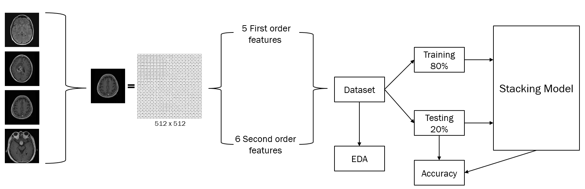

# Brain Tumor Classification with Stacking Method

[](https://opensource.org/licenses/MIT)
[](https://www.python.org/downloads/)
[](https://github.com/crisdanrodriguez/brain_tumor_classification/actions)

<p align="center">
  
</p>

A machine learning project for brain tumor classification using the **Stacking ensemble method**. This project compares stacking implementations (from scratch vs. scikit-learn) and extracts image features using texture analysis.

## Table of Contents
- [Overview](#overview)
- [Dataset](#dataset)
- [Features](#features)
- [Installation](#installation)
- [Usage](#usage)
- [Testing](#testing)
- [Project Structure](#project-structure)
- [Results](#results)
- [Documentation](#documentation)
- [License](#license)

## Overview

This project implements brain tumor classification using:
- **Texture feature extraction** (GLCM, first-order statistics)
- **Ensemble learning** with the stacking method
- **Model comparison** (KNN, Decision Tree, Naive Bayes)
- **Two implementations**: from scratch and using scikit-learn

The stacking method combines weak learners (level 0) with a meta-learner (level 1) to improve classification performance.

This project leverages AI-assisted development tools to enhance code quality, documentation, and project structure. AI was instrumental in optimizing the implementation, improving error handling, generating comprehensive documentation, and ensuring best practices for maintainable and collaborative code.

## Dataset

The dataset includes MRI brain images classified into 4 categories:
- **Glioma Tumor**
- **Meningioma Tumor**
- **No Tumor**
- **Pituitary Tumor**

**Splits:**
- Training: Images for model training
- Testing: Images for model evaluation

CSV file format: `brain_tumor_dataset.csv` with extracted features

## Features

### Texture Features Extracted:
1. **First-order statistics:**
   - Mean, Variance, Standard Deviation
   - Skewness, Kurtosis, Entropy

2. **Texture properties (GLCM):**
   - Contrast, Dissimilarity, Homogeneity
   - Angular Second Moment (ASM), Energy, Correlation

## Installation

### Prerequisites
- Python 3.8 or higher
- pip or Anaconda

### Setup
```bash
# Clone the repository
git clone https://github.com/crisdanrodriguez/brain_tumor_classification.git
cd brain_tumor_classification

# Create virtual environment (optional but recommended)
python -m venv venv
source venv/bin/activate  # On Windows: venv\Scripts\activate

# Install dependencies
pip install -r requirements.txt
```

## Usage

### 1. Extract Features from Images
```bash
python features_extraction.py
```
Generates feature vectors from raw MRI images and saves them to CSV.

### 2. Train Stacking Model (Scikit-learn)
```bash
python stacking_sklearn.py
```
Implements stacking using scikit-learn's `StackingClassifier`.

### 3. Train Stacking Model (From Scratch)
```bash
python stacking_from_scratch.py
```
Manual implementation of the stacking ensemble technique.

### 4. Exploratory Data Analysis
```bash
jupyter notebook EDA.ipynb
```
Interactive analysis of the dataset and feature distributions.

## Project Structure
```
brain_tumor_classification/
├── README.md                                    # This file
├── test_basic.py                                # Basic functionality tests
├── LICENSE                                      # MIT License
│
├── features_extraction.py                       # Feature extraction from images
├── stacking_sklearn.py                          # Stacking with scikit-learn
├── stacking_from_scratch.py                     # Manual stacking implementation
├── EDA.ipynb                                    # Exploratory Data Analysis
│
├── data/
│   ├── brain_tumor_dataset.csv                  # Dataset features
│   ├── Training/                                # Training images
│   │   ├── glioma_tumor/
│   │   ├── meningioma_tumor/
│   │   ├── no_tumor/
│   │   └── pituitary_tumor/
│   └── Testing/                                 # Testing images
│       ├── glioma_tumor/
│       ├── meningioma_tumor/
│       ├── no_tumor/
│       └── pituitary_tumor/
│
├── .github/
│   ├── workflows/tests.yml                      # CI/CD pipeline
│   ├── ISSUE_TEMPLATE/
│   │   ├── bug_report.md                        # Bug report template
│   │   └── feature_request.md                   # Feature request template
│   └── PULL_REQUEST_TEMPLATE.md                 # PR template
│
├── implementation_diagram.png                   # Architecture diagram
├── BTC_presentation.pptx                        # Presentation slides
└── Brain Tumor Classification with Stacking Method.pdf  # Detailed documentation
```

## Results

The stacking method combines:
- **Base Learners (Level 0):** KNN (k=5), Decision Tree (depth=7), Gaussian Naive Bayes
- **Meta-Learner (Level 1):** KNN (k=5)
- **Cross-validation:** 5-fold with 4 repeats

Model performance is evaluated using accuracy scores across all models.

For detailed results and comparisons, see the [full documentation](https://github.com/crisdanrodriguez/brain_tumor_classification/blob/main/Brain%20Tumor%20Classification%20with%20Stacking%20Method.pdf).

## Testing

Run the basic test suite to ensure all components work correctly:
```bash
python test_basic.py
```

Tests include:
- Import validation for all modules
- Basic functionality checks
- Model instantiation tests

## Documentation

- `Brain Tumor Classification with Stacking Method.pdf` - Comprehensive technical documentation
- `BTC_presentation.pptx` - Project presentation
- `EDA.ipynb` - Jupyter notebook with data analysis
- **[Towards AI Publication](https://towardsai.net/p/l/stacking-ensemble-method-for-brain-tumor-classification-performance-analysis)** - Article about this project
## License

This project is licensed under the MIT License - see the [LICENSE](LICENSE) file for details.

---

**Last Updated:** April 2024
